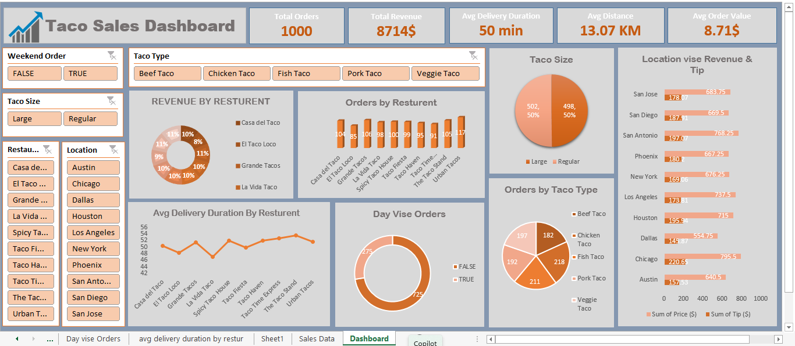

# 🌮 Taco Sales Analysis Dashboard
## 📌 Project Overview

This Excel project analyzes taco delivery data to understand order patterns, delivery performance, and revenue distribution.
The project demonstrates data cleaning, transformation, KPI creation, interactive filters (slicers), and visualizations using Microsoft Excel.

# 📂 Dataset

The dataset contains the following columns:
| columns            | Description                                       |
|--------------------|---------------------------------------------------| 
| Order ID           | Unique identifier for each order                  |
| Restaurant Name    | Name of the restaurant                            |
| Location           | Delivery location                                 |
| Order Time         | Time when the order was placed                    |
| Delivery Time      | Time when the order was delivered                 |
| Delivery Duration  | Delivery duration in minutes                      |
| Taco Size          | Size of taco (Small, Medium, Large)               |
| Taco Type          | Type of taco (Vegetarian, Chicken, Beef, etc.)    |
| Toppings Count     | Number of toppings added                          |
| Distance (km)      | Distance between restaurant and delivery location |
| Price ($)          | Order price                                       |
| Tip ($)            | Tip given by customer                             |
| Weekend Order      | Boolean (True/False)                               | 

# 🔧 Data Cleaning & Transformation

- Created Total Revenue column (Price + Tip)

- Extracted Order Date and Order Time separately

- Changed data types for Date and Time columns

- Applied filters to cleanly analyze data

# 📊 Key Performance Indicators (KPIs)

- Total Orders

- Total Revenue

- Average Delivery Duration

- Average Distance

- Average Order Value (AOV) - (Total Revenue / Total Orders)

# 🎛 Interactive Slicers

To enable dynamic analysis, slicers were created for:

- Location

- Restaurant

- Taco Type

- Taco Size

- Weekend Order (True/False)

# 📈 Visualizations (Excel Charts)
| Chart                |  Type |
|-----------------------|---------------|  
|Revenue by Restaurants | Doughnut Chart|
|Orders by Restaurant | Column Chart|
|Total Orders by Taco Size | Pie Chart|
|Total Orders by Taco Type | Pie Chart|
|Day-wise Orders (Weekdays vs Weekends) | Doughnut Chart|
|Average Delivery Duration by Restaurants | Line Chart|
|Restaurant-wise Tip & Revenue | Bar Chart|

(📸 Add screenshots of these charts in the repo for better presentation.)


# 🚀 Tools Used

**Microsoft Excel – for data cleaning, analysis, slicers, and visualizations**

# 📁 Repository Structure

```📂 Taco-Delivery-Analysis
 ┣ 📊 Taco_Delivery_Data.xlsx   # Cleaned dataset with KPIs & dashboard
 ┣ 📸 screenshots/              # (optional) screenshots of charts/dashboard
 ┗ 📄 README.md                 # Project documentation
```


# 👤 Author

**IqraIzhar**
- **LinkedIn:** [linkedin.com/in/iqra-izhar-08b8b8330](https://www.linkedin.com/in/iqra-izhar-08b8b8330)  
- **GitHub:** [github.com/iqraizhar72](https://github.com/iqraizhar72)
- **Email:** [iqraizhar72@gmail.com](mailto:iqraizhar72@gmail.com)

# 🌟 Feedback & Support

Feel free to share suggestions or compliments — your feedback is appreciated!  
If you found this project useful, please consider giving it a ⭐️.
